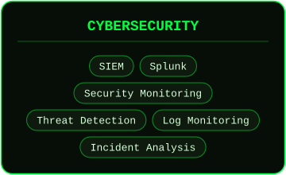
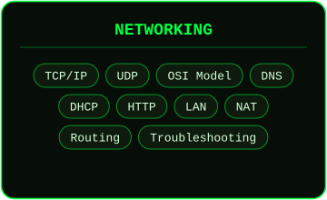
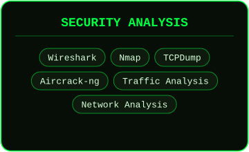
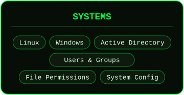
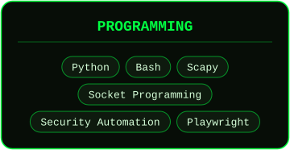
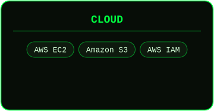
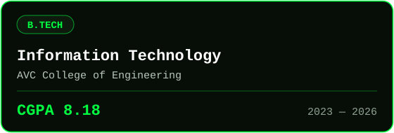
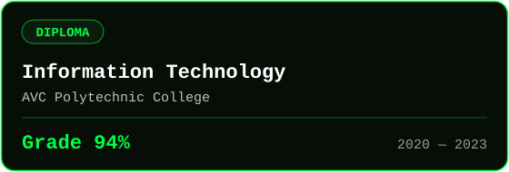

 

---

## 🛡️ About Me

I'm **Harin M**, a B.Tech Information Technology graduate (2026) focused on **defensive security**: monitoring networks, analyzing traffic, and detecting threats. I enjoy building practical security tools in Python and strengthening my blue-team skills with hands-on labs.

- 🔭 Learning: SIEM (Splunk), threat detection, cloud security on AWS
- 🛠️ Building: Wi-Fi attack detection and network tools in Python
- 🎯 Interested in: SOC / security analyst / network security roles
- 📫 Reach me: [harinmurugantamil@gmail.com](mailto:harinmurugantamil@gmail.com)

---

## ⚡ Technical Skills

&nbsp;&nbsp;&nbsp;&nbsp;&nbsp;&nbsp;

---

## 🔐 Security Projects

<table>
<tr>
<td width="50%" valign="top">

### 🔴 Wi-Fi Guardian — Wi-Fi Attack Detection

A wireless security monitoring tool that identifies suspicious Wi-Fi activity.

**Detects**
- Deauthentication attacks
- Rogue access points
- MAC spoofing
- Sniffing attempts
- Evil Twin attacks
- Router-based user blocking

**Tech:** Python · Scapy · Linux · Airmon-ng · Airodump-ng · Wireshark · TCPDump

[**→ View Project**](https://github.com/YOUR_USERNAME/wifi_guardian)

</td>
<td width="50%" valign="top">

### 🟢 Hotspot File Transfer (HFT)

A peer-to-peer file-transfer app for devices on the same local Wi-Fi network.

**Features**
- Device discovery
- TCP file transfer
- UDP communication
- Local device-to-device messaging
- Socket programming

**Tech:** Python · TCP · UDP · Sockets · Wi-Fi

[**→ View Project**](https://github.com/YOUR_USERNAME/HFT)

</td>
</tr>
</table>

---

## 🧪 Experience

### QA Automation Intern — Zoho Corporation
`September 2025 – November 2025` · Zoho Analytics Plus

- Developed automated test cases using **Playwright**
- Executed functional testing and identified, reproduced and documented defects
- Collaborated with the QA team to improve test coverage

---

## 🎓 Education

---

## 🏆 Certification

[-1BA0D7?style=for-the-badge&logo=cisco&logoColor=white)](https://www.netacad.com/)

---

## 📊 GitHub Activity

---

**Detecting · Analyzing · Securing**

